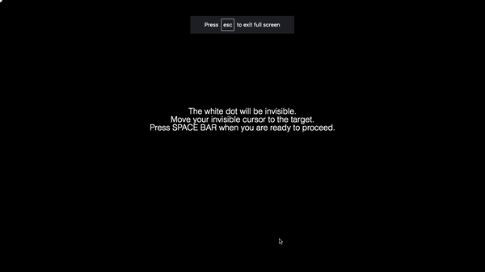

# OnPoint: A package for online experiments in motor control and motor learning

The goal of the github repository is to help you host your motor learning experiment online. For a detailed step-by-step breakdown, please visit the [OnPoint Manual for Online Experiment Hosting](https://docs.google.com/document/d/1E5XzQU2dJw7m880P7VhmESPpUNQlEdMcf9fweHLtG0o/edit?usp=sharing). The experiment is in essence a website coded in Javascript/HTML/CSS and hosted on the [Firebase server](https://firebase.google.com/). Participants can be recruited using [Amazon Mechanical Turk Requester](https://requester.mturk.com/), [Prolific](https://www.prolific.co/), or any other crowdsourcing platform. 

[Try out one of our experiments here.](https://multiclamp-c2.web.app/) 

## Dependencies

1. [Python3](https://www.python.org/downloads/) 
2. [NPM](https://www.npmjs.com/get-npm): requirement to download Firebase 
3. [Firebase](https://firebase.google.com/docs/cli): functions needed to host your online experiment on Google's Firebase server. 
4. [Amazon Mechanical Turk Requester](https://requester.mturk.com/) & [Prolific](https://www.prolific.co/): Crowdsourcing websites used to recruit participants. 

## Important files

1. Javascript code to make your experiment dynamic (e.g., appearance of a target): `public/index.js` 
2. HTML files to create the content (e.g., experiment instructions): `public/index.html` 
3. CSS files to style your content (e.g., color): `public/static/`.
4. JSON target files (e.g., experiment design, with one row corresponding to one trial): `public/tgt_files/`. 
5. Downloading data from the Firebase server to your local computer: `python_scripts/db_csv.py`. 
6. Generate JSON target files: `public/tgt_files/generate_test_rot.py`.
7. Convert CSV target files into JSON files: `python_scripts/csv_json.py`.
8. Example JSON target file: `public/tgt_files/demo_file`

## Need help?

If you are stuck, please make a comment on the [Manual](https://docs.google.com/document/d/1E5XzQU2dJw7m880P7VhmESPpUNQlEdMcf9fweHLtG0o/edit?usp=sharing) or use the [github's issue tab](https://github.com/alan-s-lee/Reaching_Exp_Online/issues)!

## Acknowledgements

J.S.T was funded by a 2018 Florence P. Kendall Scholarship from the Foundation for Physical Therapy Research. This work was supported by grant NS092079 from the National Institutes of Health. 

## References

[1] Helmholtz, H. L. F. V. (1924). Treatise on physiological optics. New York, NY: Dover Publications.  
[2] Krakauer, J. W., Pine, Z. M., Ghilardi, M. F., & Ghez, C. (2000). Learning of visuomotor transformations for vectorial planning of reaching trajectories. The Journal of Neuroscience: The Official Journal of the Society for Neuroscience, 20(23), 8916–8924.  
[3] Krakauer, John W., Hadjiosif, A. M., Xu, J., Wong, A. L., & Haith, A. M. (2019a). Motor Learning. Comprehensive Physiology, 9(2), 613–663.  
[4] Krakauer, John W., Hadjiosif, A. M., Xu, J., Wong, A. L., & Haith, A. M. (2019b). Motor Learning. Comprehensive Physiology, 9(2), 613–663.  
[5] Roemmich, R. T., & Bastian, A. J. (2018). Closing the Loop: From Motor Neuroscience to Neurorehabilitation. Annual Review of Neuroscience, 41, 415–429.  
[6] Shadmehr, R., Smith, M. A., & Krakauer, J. W. (2010). Error correction, sensory prediction, and adaptation in motor control. Annual Review of Neuroscience, 33, 89–108.  
[7] Tseng, Y.-W., Diedrichsen, J., Krakauer, J. W., Shadmehr, R., & Bastian, A. J. (2007). Sensory prediction errors drive cerebellum-dependent adaptation of reaching. Journal of Neurophysiology, 98(1), 54–62.

