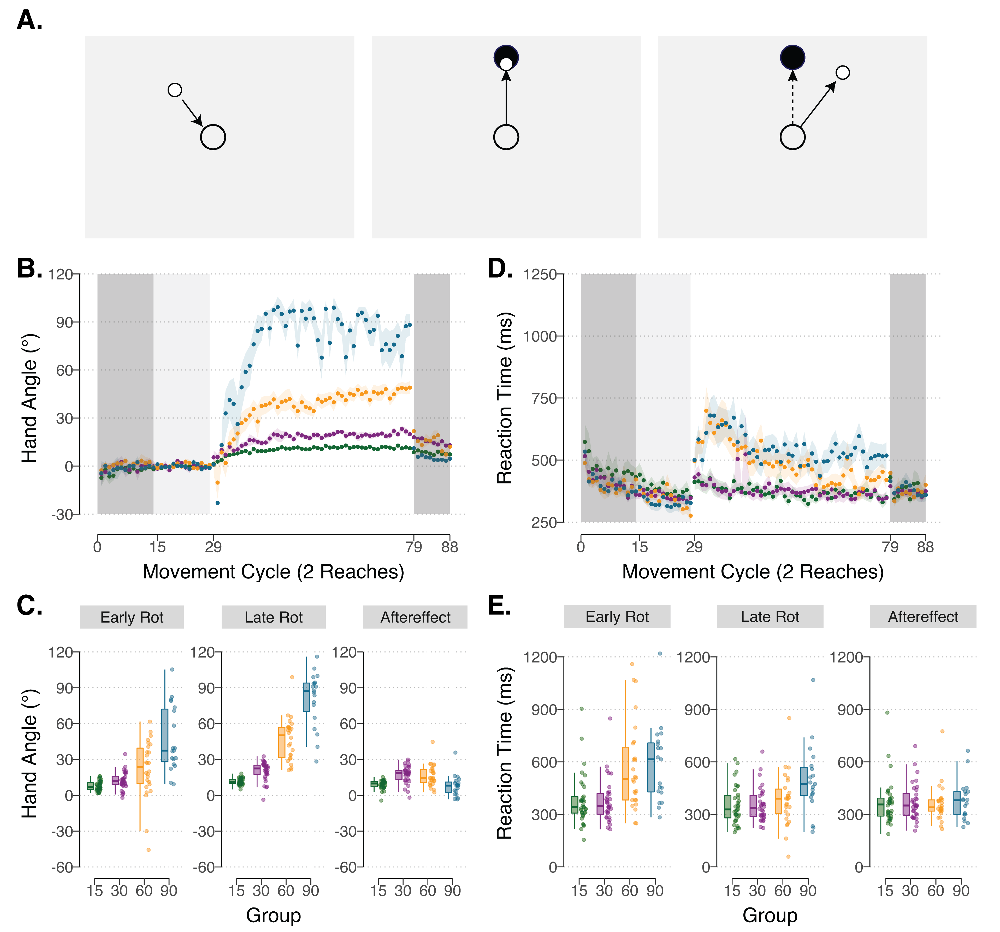

# Summary

The ability to produce a wide repertoire of movements, and to adjust those movements in response to changes in the body and environment, is a core feature of human competence. This ability allows babies to learn how to reach and walk, athletes to achieve incredible levels of skill, and patients to recover from injury and neurological disorders [@Krakauer:2020; @Roemmich:2018]. By improving our understanding of how movements are learned, we can uncover general principles about how the motor system functions and develops, optimize training techniques for sport and rehabilitation, and design better brain-machine interfaces.

A paradigmatic approach for studying motor learning is to introduce a novel mapping between the motion of the arm and the corresponding visual feedback [@Krakauer:2000]. Historically, such visuomotor perturbations have been accomplished by the use of prism glasses, which can displace the visual field vertically or laterally [@Von:1924]. Nowadays, simple virtual reality setups allow for more direct and flexible control of the relationship between hand position and the position of a a feedback signal. A commonly used perturbation in such studies is visuomotor rotation. Here, participants reach to a visual target with vision of their arm occluded. Feedback is provided in the form of a cursor presented on a computer monitor. After a brief training period during which the feedback corresponds to the to the actual hand position, a perturbation is introduced by rotating the position of the cursor from the actual hand position (e.g., 45°) [@Krakauer:2000]. When the rotation is applied, participants gradually adjust their movements over several trials to compensate for the perturbation in an attempt to improve performance [@Shadmehr:2010]. 

Motor learning experiments are typically run in-person, exploiting finely calibrated setups (digitizing tablets, robotic manipulandum, full VR displays, etc.) that provide high temporal and spatial resolution. However, these experiments come at a cost, not limited to the one-time expense of purchasing equipment but also the substantial time devoted to recruiting participants to come to the lab and then the time required to administer the experiment.  Moreover, exceptional circumstances that limit in-person testing, such as a global pandemic, may halt research progress. 

These limitations of in-person motor learning research have motivated the design of OnPoint, an open-source software package for motor control and motor learning researchers. OnPoint provides kinematic data with good temporal (e.g., reaction and movement time) and spatial resolution (e.g., motor bias and motor variance). OnPoint offers an unprecedented opportunity to implement on-line motor control experiments with minimal cost online. Online motor learning experiments reduce the time (and money) required for recruitment and testing participants in the lab. Moreover, online studies expand the pool of participants from a homogenous university setting to a heterogeneous online community (e.g., via Amazon Mechanical Turk and Prolific). As with all online studies, OnPoint offers an opportunity to the motor learning community to conduct large-N motor learning studies, with potential applications to do faster pilot testing, replicate previous findings, and conduct longitudinal studies. 

OnPoint consists of a dynamic webpage programmed in Javascript, HTML, and CSS. These webpages can be hosted on any server (e.g., Google Firebase, Amazon Web Services). Python packages are then used to download your data from the public server to your local computer. OnPoint is available on Github, with a step-by-step guide that walks through the entire pipeline. 

 

Figure 1: OnPoint Visuomotor Rotation Experiment Method and Results. (A) Left: Participants begin each reach by positioning their cursor (solid white circle) on their computer screen (grey background) in the start position (empty white circle). Middle, Right: A target (black circle) is then presented along an invisible ring for participants to move their cursor toward. The two examples illustrate cases where the cursor feedback is either unperturbed (middle) or rotated (right). (B) Mean time course of hand angles for 15° (green, n=30), 30° (purple, n=30), 60° (yellow, n=15), and 90° (blue, n=15) visuomotor rotation conditions. Hand angle is presented relative to the target (0°) during no feedback (dark grey background), veridical feedback (light grey background), and rotation trials (white background). Shaded region denotes standard error of the mean. (C) Average heading angles during early (cycles 31 – 40, each cycle represents 2 movements to 2 different targets) and late phases of the rotation block (cycles 69 – 78), and during the no feedback aftereffect block (cycles 79 – 81). Box plots denote the median (thick horizontal lines), quartiles (1st and 3rd, the edges of the boxes), and extrema (min and max, vertical thin lines). Each individual participant is shown (translucent dots). (D) Mean time course of reaction time. (E) Average reaction time during early and late phases of the rotation block, and during the no feedback aftereffect block. 

# Acknowledgements

J.S.T was funded by a 2018 Florence P. Kendall Scholarship from the Foundation for Physical Therapy Research. This work was supported by grant NS092079 from the National Institutes of Health. 

# References
